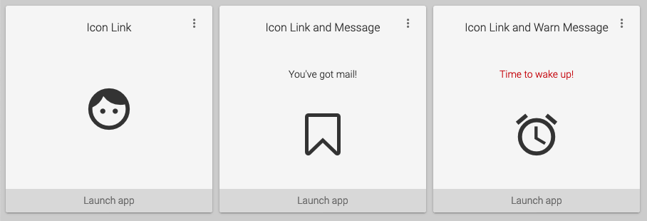

# myuw-card



## Getting Started

Import and include the component as follows:

```html
<script type="module" src="https://cdn.my.wisc.edu/@myuw-web-components/myuw-card@latest/myuw-card.min.mjs"></script>

<!-- fallback for browsers without ES2015 module support -->
<script nomodule src="https://cdn.my.wisc.edu/@myuw-web-components/myuw-card@latest/myuw-card.min.js"></script>

<myuw-card-frame size="full">
  <myuw-card-header
    slot="myuw-card-header"
    title="Course Search and Enroll"
  ></myuw-card-header>
  <myuw-icon-link
    icon="face"
    icon-type="md"
    href="https://www.google.com"
  ></myuw-icon-link>
  <myuw-card-footer
    slot="myuw-card-footer"
    text="Launch app"
    href="https://www.google.com"
  ></myuw-card-footer>
</myuw-card-frame>
```

_Note:_ The evergreen "latest" version can be used for convenience, but in production settings it is
recommended to use the latest [release version](https://github.com/myuw-web-components/myuw-card/releases)
specifically, and upgrade only after testing!

## Contributing

See also: [CONTRIBUTING](contributing.md)

### Developer Requirements

* [Node.js](https://nodejs.org/en/)
* [Yarn](https://yarnpkg.com/lang/en/) (optional but recommended)
* npm (if not using Yarn)

Install dependencies:

```sh
$ yarn install
# or
$ npm install
```

Run the development server:

```sh
$ yarn start
# or
$ npm start
```

Build modules to `dist/`:

```sh
$ yarn build
# or
$ npm run build
```

[ESLint](https://eslint.org/) and [Prettier](https://prettier.io/) will be install
and are already configured. It is recommended that you use them.
